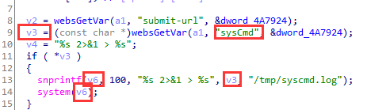

# d-link DIR-619L has  command injection vulnerability  in formSysCmd

## Information

- Vendor:https://www.dlink.com/
- Firmware:https://www.dlinktw.com.tw/techsupport/download.ashx?file=3803
- Affected Version: 2.04B04

## Vulnerability Analysis

The program receives the value of the host field through the `websGetVar` function,concatenates it into a formatted string using the `snprintf` function, and finally executes a system command using the `system` function. Since the attacker's inputis not filtered, any command can be executed.

## PoC

 Due to legal and policy reasons, we are unable to provide the exploit for this  vulnerability at this time.

##  Note

The vendor was contacted early about this disclosure but did not respond in any  way.

