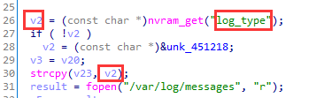

# Netgear JWNR2000v2 has  buffer overflow vulnerability  in sub_4238E8

## Information

- Vendor:https://www.netgear.com/
- Firmware:https://www.downloads.netgear.com/files/GDC/JWNR2000V2/JWNR2000v2_WNR1500-V1.0.0.11_1.0.1.zip
- Affected Version: 1.0.0.11

## Vulnerability Analysis

The program receives the value of the host field through the `nvram_get` function,copy it using the `strcpy` function. Since the `strcpy` lacks the boundary check and the attacker's input length isn't checked either , buffer overflow exists.

## PoC

 Due to legal and policy reasons, we are unable to provide the exploit for this  vulnerability at this time.

##  Note

The vendor was contacted early about this disclosure but did not respond in any  way.

