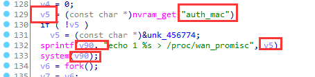

# Netgear JWNR2000v2 has  command injection vulnerability  in sub_435E04

## Information

- Vendor:https://www.netgear.com/
- Firmware:https://www.downloads.netgear.com/files/GDC/JWNR2000V2/JWNR2000v2_WNR1500-V1.0.0.11_1.0.1.zip
- Affected Version: 1.0.0.11

## Vulnerability Analysis

The program receives the value of the host field through the `nvram_get` function,concatenates it into a formatted string using the `sprintf` function, and finally executes a system command using the `system` function. Since the attacker's input is not filtered, any command can be executed.

## PoC

 Due to legal and policy reasons, we are unable to provide the exploit for this  vulnerability at this time.

##  Note

The vendor was contacted early about this disclosure but did not respond in any  way.

