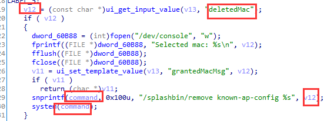

# Netgear WG302v2 has  command injection vulnerability  in rogueap_handler

## Information

- Vendor:https://www.netgear.com/
- Firmware:https://www.downloads.netgear.com/files/GDC/WG302V2/WG302v2%20Firmware%20Version%205.2.9.zip
- Affected Version: 5.2.9

## Vulnerability Analysis

The program receives the value of the host field through the `ui_get_input_value` function,concatenates it into a formatted string using the `snprintf` function, and finally executes a system command using the `system` function. Since the attacker's input is not filtered, any command can be executed.

## PoC

 Due to legal and policy reasons, we are unable to provide the exploit for this  vulnerability at this time.

##  Note

The vendor was contacted early about this disclosure but did not respond in any  way.

