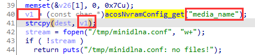

# Netgear EX6200 has  buffer overflow vulnerability  in sub_47F7C

## Information

- Vendor:https://www.netgear.com/
- Firmware:https://www.downloads.netgear.com/files/GDC/EX6200/EX6200-V1.0.3.94_1.1.128.zip?_ga=2.18800570.2092640780.1744442456-1939626221.1744442455
- Affected Version: 1.0.3.94

## Vulnerability Analysis

The program receives the value of the host field through the `acosNvramConfig_get` function,copy it using the `strcpy` function. Since the `strcpy` lacks the boundary check and the attacker's input length isn't checked either , buffer overflow exists.

## PoC

 Due to legal and policy reasons, we are unable to provide the exploit for this  vulnerability at this time.

##  Note

The vendor was contacted early about this disclosure but did not respond in any  way.

