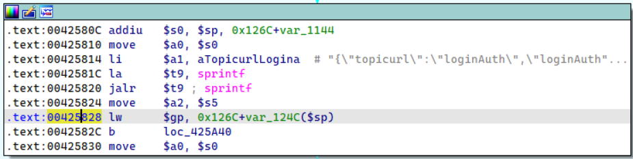

# TOTOlink N350RT(V9.3.5u.6139_B20201216) router has post-authentication buffer overflow vulnerability
## Information

Vendor：http://totolink.net/

Firmware：https://www.totolink.net/home/menu/detail/menu_listtpl/download/id/206/ids/36.html

**This product is on sale**: https://www.totolink.net/home/menu/newstpl/menu_newstpl/products/id/206.html
## Affected Version
V9.3.5u.6139_B20201216
## Vulnerability Analysis
The following image displays the code for a stack overflow vulnerability in the `main` function of `cstecgi.cgi`. When an attacker accesses `http://ip/cgi-bin/cstecgi.cgi?action=login&flag=1` using the POST method, all data in the `HTTP BODY` will be read into `v8` and concatenated to the local variable `v33` using the sprintf function. Due to the lack of length validation by the developer on `v8`, sending an overly long message by the attacker will eventually cause a stack overflow in the program. As this code segment resides at the beginning of the main function, the attacker does not need to undergo any form of authentication.

## POC
```python
import requests
def poc():
    payload = "A"*5000
    response = requests.post('http://192.168.5.12/cgi-bin/cstecgi.cgi?action=login&flag=1', data=payload)
    print(response.status_code)
poc()
```
I set a breakpoint at `0x425828` (the next instruction after the stack overflow occurred) in `cstecgi.cgi`. I observed that the region on the stack originally meant for holding the return address was overwritten with `AAAA`, confirming the occurrence of a stack overflow. If it's possible to leak the libc base address, it might even lead to achieving Remote Code Execution (RCE).

