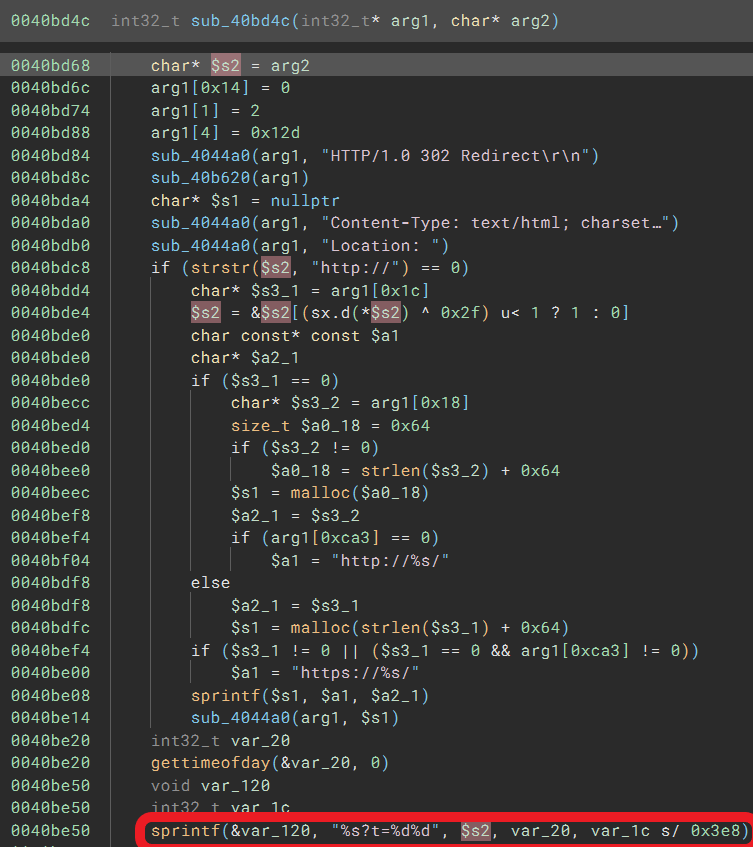

# TOTOLINK X2000R(V1.0.0-B20221212.1452) router has stack overflow vulnerability
## Information

Vendor：http://totolink.net/

Firmware：https://www.totolink.net/home/menu/detail/menu_listtpl/download/id/242/ids/36.html

## Affected Version
V1.0.0-B20221212.1452
## Vulnerability Analysis
The following image displays the code for a stack overflow vulnerability in the `sub_44f3c8` function of web server `boa`, which is the handler of `http://x.x.x.x/boafrm/formRoute`. The value of the `submit-url` parameter is passed to the variable `$v0_58` and passed as the second argument to the `sub_40bd4c` function. The `sub_40bd4c` function passes the value of the second parameter `arg2` to `$s2`. Without performing length checks, the `sub_40bd4c` function concatenates `$s2` to a local variable `&var_120` using the `sprintf` function. From the described passing, it is evident that `$s2` points to the value of the `submit-url` parameter (controlled by the attacker). Therefore, an attacker only needs to send excessively long data through the submit-url parameter to trigger a stack overflow vulnerability.

Here's the image of `sub_40bd4c` function

## POC
Due to legal and policy reasons, we are unable to provide the exploit for this vulnerability at this time.