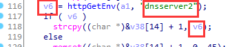

# tp-link WR841ND has  buffer overflow vulnerability  in sub_44C730

## Information

- Vendor:https://www.tp-link.com/
- Firmware:https://static.tp-link.com/res/down/soft/TL-WR841ND_V11_150616.zip
- Affected Version: 11.150616

## Vulnerability Analysis

The program receives the value of the host field through the `httpGetEnv` function,copy it using the `strcpy` function. Since the `strcpy` lacks the boundary check and the attacker's input length isn't checked either , buffer overflow exists.

## PoC

 Due to legal and policy reasons, we are unable to provide the exploit for this  vulnerability at this time.

##  Note

The vendor was contacted early about this disclosure but did not respond in any  way.

